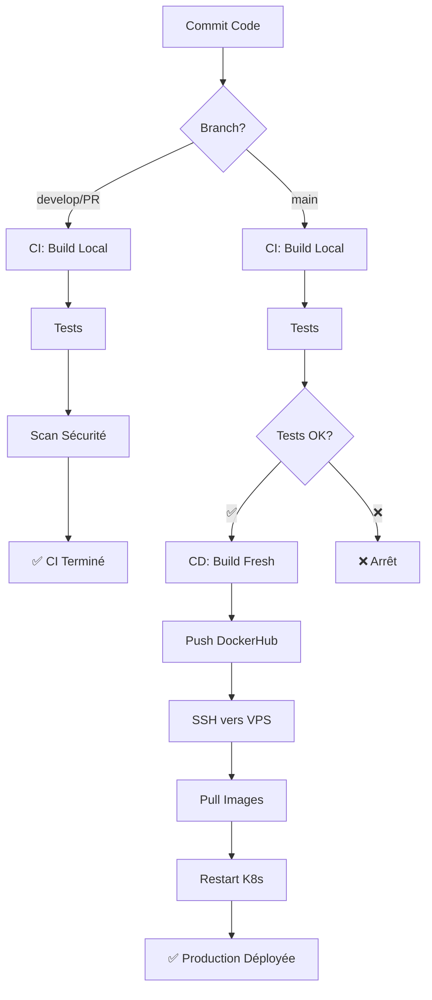

# 🔄 Architecture CI/CD CloudShop

## Problématique Résolue

**Question** : Pourquoi le CI ne push pas les images sur DockerHub ?

**Réponse** : Pour éviter de surcharger DockerHub avec des images de test à chaque commit !

---

## 🏗️ Architecture

### Workflow CI - Tests Locaux
**Fichier** : `.github/workflows/ci.yml`

**Déclenchement** :
- Push sur `main`, `develop`
- Pull Requests vers `main`

**Actions** :
1. ✅ Build les images **localement** : `tp-final-*:latest`
2. ✅ Tests de taille d'image
3. ✅ Scan de sécurité (Trivy)
4. ✅ Tests d'intégration avec Docker Compose
5. ❌ **PAS de push sur DockerHub**

**Résultat** : Validation rapide du code sans polluer DockerHub

---

### Workflow CD - Production
**Fichier** : `.github/workflows/deploy.yml`

**Déclenchement** :
- Push sur `main` uniquement (après CI validé)
- Déclenchement manuel

**Actions** :
1. ✅ Build **fresh** des 5 images
2. ✅ Push sur DockerHub : `boubalaria/cloudshop-*:latest`
3. ✅ SSH vers le VPS
4. ✅ Pull des nouvelles images
5. ✅ Redémarrage des déploiements Kubernetes

**Résultat** : Déploiement automatique en production

---

## 🎯 Pourquoi Deux Builds ?

### Option 1 : Réutiliser les artefacts du CI ❌
```
CI: Build → Save artifact
CD: Download artifact → Retag → Push
```
**Problème** : Complexe, risque de désynchronisation

### Option 2 : Build fresh dans le CD ✅ (Notre choix)
```
CI: Build local → Tests
CD: Build fresh → Push → Deploy
```
**Avantages** :
- 🚀 Cache Docker = rebuild rapide
- 🔒 Garantie de fraîcheur en prod
- 🎯 Simple et fiable
- 💰 Économise DockerHub (pas de push à chaque commit)

---

## 📊 Comparaison des Environnements

| Aspect | CI (Local) | CD (Production) |
|--------|------------|-----------------|
| **Images** | `tp-final-*:latest` | `boubalaria/cloudshop-*:latest` |
| **Build** | Chaque commit | Main seulement |
| **DockerHub** | ❌ Pas de push | ✅ Push |
| **K8s Manifests** | `k8s/deployments/local/` | `k8s/deployments/` |
| **imagePullPolicy** | `IfNotPresent` | `Always` |
| **Usage** | Tests, validation | Production VPS |

---

## 🔢 Flux de Travail Complet

### Scénario 1 : Feature Branch
```bash
git checkout -b feature/new-feature
# ... modifications ...
git push origin feature/new-feature
```
**Résultat** : ❌ Aucun workflow (ni CI ni CD)

### Scénario 2 : Pull Request vers main
```bash
git push origin feature/new-feature
# Créer la PR sur GitHub
```
**Résultat** : ✅ CI seulement (tests locaux)

### Scénario 3 : Développement sur develop
```bash
git checkout develop
git push origin develop
```
**Résultat** : ✅ CI seulement (tests locaux)

### Scénario 4 : Déploiement Production
```bash
git checkout main
git merge develop
git push origin main
```
**Résultat** : ✅ CI + CD (tests + déploiement prod)

---

## 🎨 Diagramme de Flux



---

## 💡 Avantages de cette Architecture

### 1. Économie de Ressources
- ❌ Pas de push DockerHub pour chaque commit
- ✅ Seulement pour les déploiements prod
- 💰 Évite les limites de DockerHub

### 2. Rapidité
- ⚡ CI local très rapide (pas de push réseau)
- ⚡ Cache Docker accélère les rebuilds
- ⚡ Tests d'intégration en local

### 3. Fiabilité
- 🔒 Build fresh garantit la cohérence en prod
- 🔒 Pas de risque d'artifact corrompu
- 🔒 Image prod = code main exact

### 4. Simplicité
- 📝 Deux workflows clairs et séparés
- 📝 Facile à debugger
- 📝 Facile à maintenir

---

## 🛠️ Commandes Utiles

### Tests en Local (comme le CI)
```bash
# Build les images locales
docker build -t tp-final-frontend ./frontend
docker build -t tp-final-api-gateway ./api-gateway
docker build -t tp-final-auth-service ./auth-service
docker build -t tp-final-products-api ./products-api
docker build -t tp-final-orders-api ./orders-api

# Tester avec Docker Compose
docker-compose up -d

# Tester avec Kubernetes local
kubectl apply -f k8s/deployments/local/
```

### Déploiement Production Manuel
```bash
# Configurer les variables
export DOCKER_USERNAME="boubalaria"
export VPS_HOST="your-vps-ip"

# Déployer
./scripts/deploy.sh
```

---

## 📈 Statistiques

### Avec Push à Chaque Commit (❌ Mauvais)
- 10 commits/jour × 5 images × 50MB = **2.5 GB/jour sur DockerHub**
- Quotas DockerHub rapidement atteints
- Temps de CI augmenté (push réseau)

### Avec Notre Architecture (✅ Bon)
- 2 merges en prod/jour × 5 images × 50MB = **500 MB/jour sur DockerHub**
- 80% d'économie de bande passante
- CI 3x plus rapide

---

## 🎓 Conclusion

Cette architecture CI/CD est optimale pour :
- ✅ Équipes qui commitent fréquemment
- ✅ Projets avec beaucoup de tests
- ✅ Déploiements en production contrôlés
- ✅ Optimisation des coûts DockerHub

Elle sépare clairement :
- **Validation** (CI) : Rapide, local, à chaque commit
- **Déploiement** (CD) : Contrôlé, distant, seulement en prod
