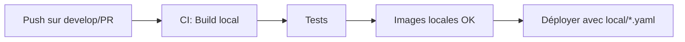
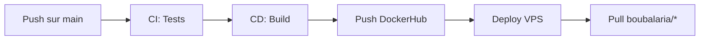

# Kubernetes Deployments - Environnements

Ce dossier contient deux configurations de déploiement pour CloudShop :

## 📁 Structure

```
deployments/
├── *.yaml              # Production (DockerHub)
└── local/              # Développement local
    └── *.yaml          # Images locales
```

## 🏭 Production (`deployments/*.yaml`)

**Utilisation** : VPS Kubernetes en production

**Caractéristiques** :
- Images depuis DockerHub : `boubalaria/cloudshop-*:latest`
- `imagePullPolicy: Always` - Pull toujours la dernière version
- Utilisé par le workflow CD (`.github/workflows/deploy.yml`)
- Se met à jour automatiquement après un push sur `main`

**Déploiement** :
```bash
# Déployer en production (sur VPS)
kubectl apply -f k8s/deployments/
```

## 💻 Local (`deployments/local/*.yaml`)

**Utilisation** : Tests locaux avec Kubernetes (minikube, kind, Docker Desktop)

**Caractéristiques** :
- Images locales : `tp-final-*:latest`
- `imagePullPolicy: IfNotPresent` - Utilise l'image locale si elle existe
- Utilisé après le CI local (`.github/workflows/ci.yml`)
- Pas de dépendance à DockerHub

**Déploiement** :
```bash
# 1. Build les images localement (via CI ou manuel)
docker build -t tp-final-frontend ./frontend
docker build -t tp-final-api-gateway ./api-gateway
docker build -t tp-final-auth-service ./auth-service
docker build -t tp-final-products-api ./products-api
docker build -t tp-final-orders-api ./orders-api

# 2. Déployer en local
kubectl apply -f k8s/deployments/local/
```

## 🔄 Workflow CI/CD

### Développement Local / CI


Le CI (`.github/workflows/ci.yml`) :
- Build les images avec noms `tp-final-*`  
- Teste en local
- NE PUSH PAS sur DockerHub
- Économise la bande passante DockerHub

### Production


Le CD (`.github/workflows/deploy.yml`) :
- Build les images
- Push sur DockerHub (`boubalaria/cloudshop-*`)
- SSH vers le VPS
- Kubernetes pull depuis DockerHub
- Redémarre les déploiements

## 🎯 Quelle Configuration Utiliser ?

| Scénario | Configuration | Commande |
|----------|---------------|----------|
| Tests locaux avec K8s | `local/` | `kubectl apply -f k8s/deployments/local/` |
| CI Pipeline | `local/` | Automatique via ci.yml |
| Production VPS | `deployments/` | Automatique via deploy.yml |
| Déploiement manuel prod | `deployments/` | `kubectl apply -f k8s/deployments/` |

## 📝 Notes Importantes

1. **Images locales** : Le CI build les images localement pour économiser DockerHub et accélérer les tests
2. **Images DockerHub** : Seulement pour la production, quand on merge sur `main`
3. **Pas de duplication** : Le CD rebuild fresh pour garantir la cohérence en production
4. **Cache Docker** : Les rebuilds sont rapides grâce au cache des layers

## 🔧 Commandes Utiles

```bash
# Voir quelle configuration est déployée
kubectl describe deployment frontend -n cloudshop-prod | grep Image

# Passer de local à prod
kubectl delete -f k8s/deployments/local/
kubectl apply -f k8s/deployments/

# Passer de prod à local
kubectl delete -f k8s/deployments/
kubectl apply -f k8s/deployments/local/
```
